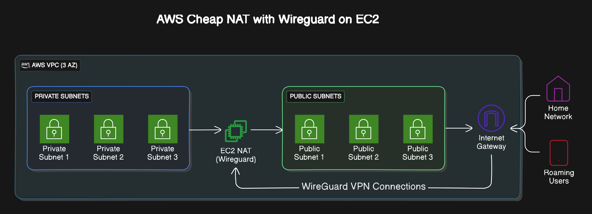
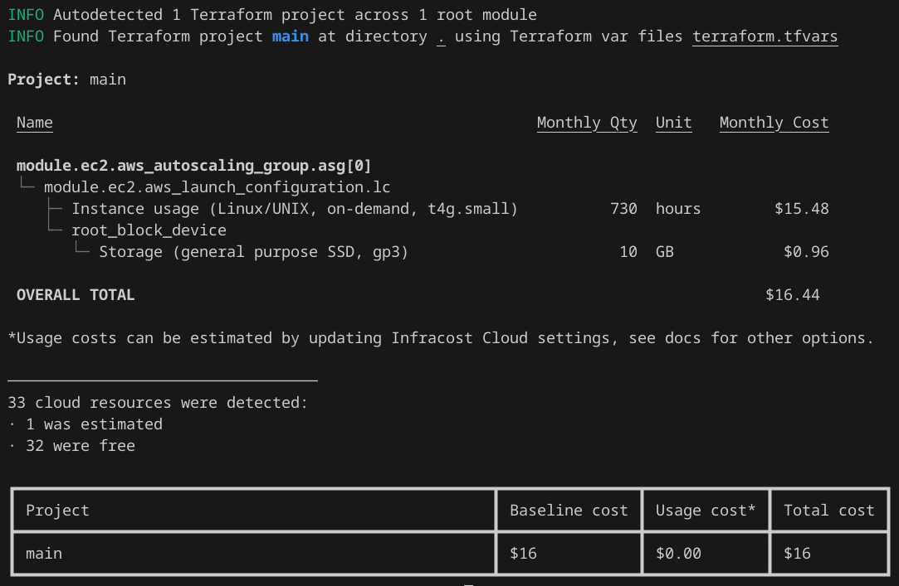

# Poor Technologists AWS NAT & WireGuard Cloud Network

# BeardBench: Checkout the guide for this repo at:

https://beardbench.isogen.io/posts/private_cloud_vpn_on_aws_part_1/index.html

# Solution Overview

I put this simple terraform project together because I wanted an easy to manage NAT instance that I could use to connect my home network securely to my AWS VPC. This enables me to access workloads across my AWS accounts for things such as Ai and Internet of Things (IoT) projects and have them accessible via my home LAN. 

Using AWS's super cheap Gravitron instances I can keep costs very low whilst having an instance that can perform multiple functions, such as running Docker containers as well as being a NAT/WireGuard router. To keep things simple though, I will leave that to your good judgement on how you want to use this instance beyond being a router. 

Being a good boy, all of this is done using infrastructure code (Terraform) and version control through github, and.. after a few too many wines went down the rabbit hole of automating my deploy using AWS CodePipline and AWS CodeBuild because I could. (I will add this to my project soon)

At a high level, the terraform deploys an EC2 instance along with an AWS VPC with 3 availability zones. The instance is configured to act as a NAT Instance for the private subnets in the VPC. The instance is also configured to act as a WireGuard VPN concentrator, allowing clients to connect to the VPC from anywhere in the world, as well as attaching my home LAN network for LAN access.

The Bootstrap does the following things:

* Installs packages from Apt and Installs the AWS CLi
* Configures Linux to enable IP Forwarding
* Disables EC2 'Source Destination Check' 
* Updates the VPC's private route tables and sets default routes to the NAT Instance
* Wireguard Configuration (Server and Client Configuration Generation)
* Sets the Hostname and Route53 A Record to the public IP of the EC2 Instance
* Raises shields and applies an IPTables Firewall ruleset in addition to the EC2's Security Group

The bootstrap will generate the wireguard encryption keys for both the client and the server and build both configuration files. The server end is built and stored under /etc/wireguard/wg0.conf and activated. The client end config is built and stored under /home/admin/wg0-client.conf, copy this file to your client end point. NOTE: These keys are generated on boot and are not stored outside of the instance, consider backing up the keys if you need to rebuild the instance.

Please also note that the security group rules are configrued to use your home routers public IPv4 address which you define inside the terraform.tfvars file under parameter MYIP. This locks down access to SSH and Wireguard ingress from your IP :) you're welcome 

A note on the use of autoscaling, I decided to opt for an Autoscale group for this solution to take advantage of its ability to self recover in the event of an AZ failure, or if the node stops responding, AWS will deploy a new instance and the bootstrap will largely self heal itself back into existance.  

NOTE: WireGuard configuration will regenerate keys, ensure you backup your configs to manually restore the wireguard service - todo Use SSM Parameter Store to store the WireGuard configuration file & add logic to auto detect/restore from SSM if node redeploys.

# TFVARS Explained:

| TFVARS Variable | Description | Default Value |
| --------------- | ----------- | ------------- |
| NAME_PREFIX     | Sets the name of the instance and the name of the VPC | Sphere |
| MYIP            | Your Public IPv4 address - Home RouterIP | 1.1.1.1/32 |
| DEPLOY_SPHERE   | Deploy NAT Instance? 1 = Yes 0 = No | 1 |
| AWSREGION       | AWS Region to deploy into | ap-southeast-4 (Melbourne) |
| AWS_ACCOUNT_ID  | Your AWS Number | 012345678912 |
| TIMEZONE        | Your Timezone | Australia/Melbourne |
| CIDR            | Preferred CIDR for VPC | 172.50.0.0/16 |
| PUBLIC_SUBNETS  | CIDR Ranges for Public Subnets (3x) | "172.50.128.0/20", "172.50.144.0/20", "172.50.160.0/20" |
| PRIVATE_SUBNETS | CIDR Ranges for Private Subnets (3x) | "172.50.64.0/20", "172.50.80.0/20", "172.50.96.0/20" |
| AZS | Availability Zones in full form | "ap-southeast-4a", "ap-southeast-4b", "ap-southeast-4c" |
| WG0CIDR | Preferred WireGuard CIDR Range for SDN | "10.10.0.0/24" |
| ZONEID | Your Route53 Zone ID | YOURZONEID |
| FQDN | Preferred Fully Qualified Domain Name |  mynat.example.com |
| ASSOCIATE_PUBLIC_IP_ADDRESS | Allocate IPv4 Public Address from AWS |  true |
| INSTANCE_TYPE | AWS EC2 Instance Type. (Gravitron Based by default) |  t4g.small |
| IMAGE_ID | AWS AMI ID (Default is Debian 12 ARM) |  Find AMI ID: Grab your regions from here https://wiki.debian.org/Cloud/AmazonEC2Image/Bookworm |
| KEY_NAME | Your EC2 Key Pair |  your-key |
| ENABLE_MONITORING | EC2 CloudWatch Monitoring (Disabled by Default) |  false |
| MAX_SIZE | EC2 ASG Max Size (Default is 1) |  1 |
| MIN_SIZE | EC2 ASG Min Size (Default is 1) |  1 |
| DESIRED_CAPACITY | EC2 ASG Desired Size (Default is 1) |  1 |
| ROOT_BLOCK_DEVICE | EC2 EBS ROOT Volume Settings |  EBS Backed 10GB Volume (GP3) |
| DEFAULT_TAGS | Tags Tags and More Tags |  Good Practice to set tags |

# Prerequisites

1. AWS Account with permissions to create resources
2. Terraform installed on your local machine
3. AWS CLI installed on your local machine
4. AWS CLI configured with your AWS account credentials
5. Basic understanding of Terraform and AWS
6. A EC2 Key Pair for SSH access to the EC2 instance (You must create this prior to launching)
7. A Route53 public zone and domain name (This can be overriden if you do not use Route53. You will need to manually manage your DNS resources for this deployment)
8. s3 Bucket for storing your terraform state file (You must create this prior to launching and define in versions.tf from the root of the repo, unhash and replace with your details)

# Usage Instructions:

1. Clone Repo
2. Ensure s3 bucket has been created to store your terraform state (set in versions.tf)
2. Update the terraform.tfvars file with your customisations
3. Run Terraform Plan and Apply
4. WireGuard Client Configuration available under /home/admin/wg0-client.conf

*WARNING* Deploying this terraform will create resources in your AWS account that may incur costs. Please review the resources created by the terraform script and ensure you understand the costs associated with them before deploying.

Recommend InfraCost.io for cost estimation before deploying. I ran this across this project and it estimated the monthly cost to be around $16 USD/month

# Terraform References

This terraform calls on the AWS VPC Terraform module to deploy the following VPC archtecture. 

See link https://registry.terraform.io/modules/terraform-aws-modules/vpc/aws/latest for more details.

*WARNING* Deploying this terraform will create resources in your AWS account that may incur costs. Please review the resources created by the terraform script and ensure you understand the costs associated with them before deploying.

# Terraform High level Contents

The terraform script deploys the following resources:

VPC Module:
- VPC with 3 availability zones
- 3 public subnets
- 3 private subnets
- 1 public routing table
- 3 private routing tables
- 1 resource tagging
EC2 Module:
- 1 t4g.small EC2 instance
- 1 launch configuration for the autoscale group with a bootstrap script userdata.sh
- 1 autoscale group with min=1, max=1 instances (For auto recovery)
- 1 SSM secure parameter for the wireguard configuration file
- 1 IAM Instance Profile
- 1 IAM Role Policy for the instance profile
Security Group Module:
- 1 security group for the EC2 instance
- 1 security group rule for the WireGuard VPN service
- 1 security group rule for SSH ingress
- 1 security group rule for to allow East - West Access across the private subnets inbound to the NAT instance